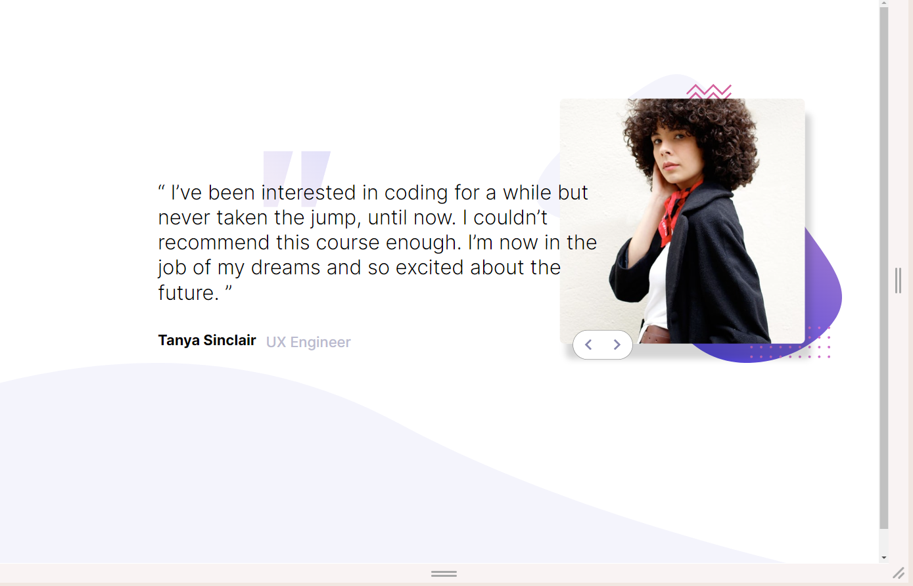

# Frontend Mentor - Coding bootcamp testimonials slider solution

## Table of contents

- [Overview](#overview)
  - [The challenge](#the-challenge)
  - [Screenshot](#screenshot)
  - [Links](#links)

  - [Built with](#built-with)
  - [What I learned](#what-i-learned)

- [Author](#author)
- [Acknowledgments](#acknowledgments)

**Note: Delete this note and update the table of contents based on what sections you keep.**

## Overview
This is a BootCampSlider page with buttons styled by javascript.
### The challenge

Users should be able to:

- View the optimal layout for the site depending on their device's screen size 
Mobile : 375px
Laptop:376px to 1439px
Desktop: 1440 px
- See hover states for all interactive elements on the page
Hovers on button

transform(scale 0.8)

### Screenshot
  

### Links

- Solution URL: [Add solution URL here](https://github.com/sehajwadhwa/BootcampSliderPage)
- Live Site URL: [Add live site URL here](https://bootslider.netlify.app/)

### Built with

- Semantic HTML5 markup
- SCSS custom properties
- Flexbox
- Mobile-first workflow

### What I learned

I have learned to use js array to visit the successive [pages]. I tried to use the PseudoElement for scss, but later removed it

## Author

- Website - [Aparna Dhara](https://bootslider.netlify.app/)
- Frontend Mentor - [@SehajWadhwa](https://www.frontendmentor.io/profile/sehajwadhwa)
- Frontend Mentor - [@AD9-1](https://www.frontendmentor.io/profile/AD9-1)
- GitHub        - https://github.com/AD9-1/BootcampSliderPage

## Acknowledgments

We worked in team of 2 front-end developers. We developed the project in JS as collaborators. 
Contributors : Aparna Dhara and Sehaj Wadhwa
